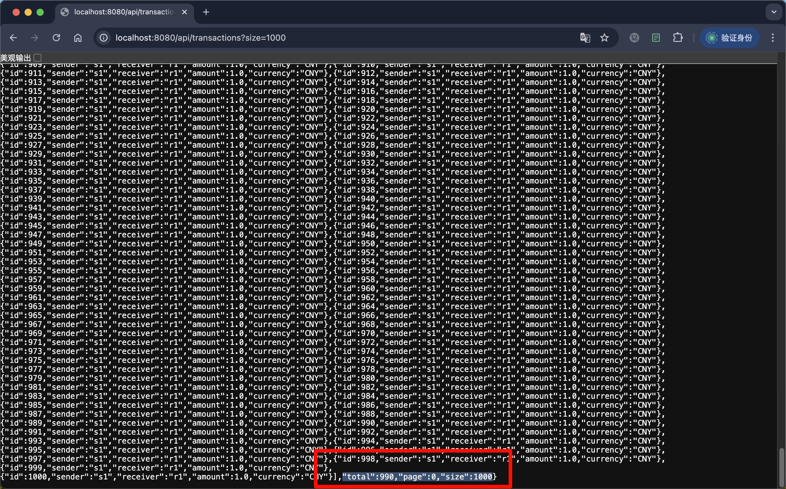
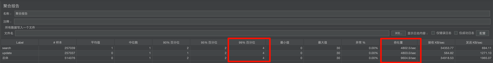
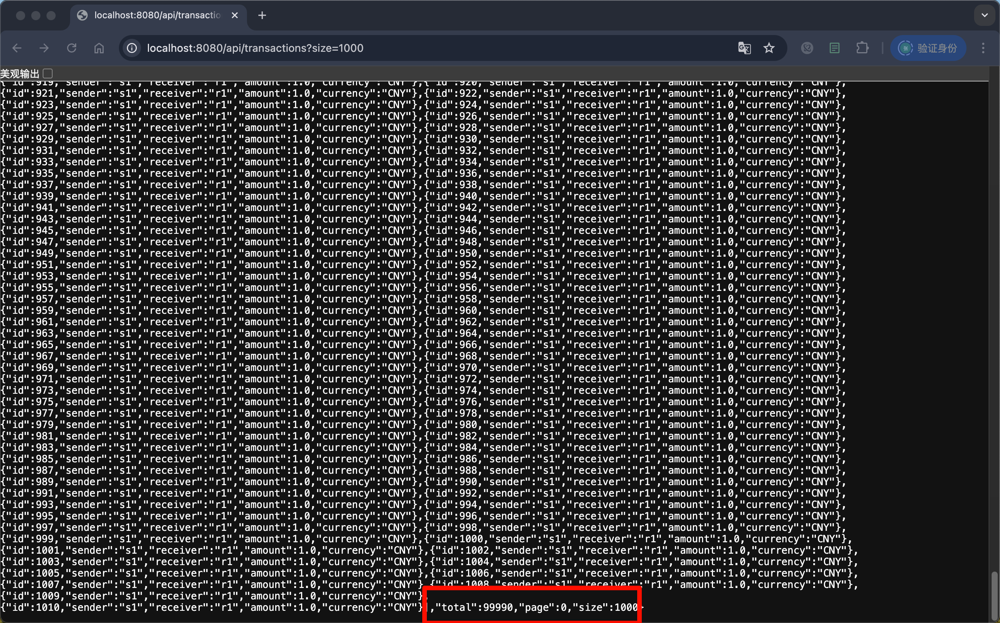
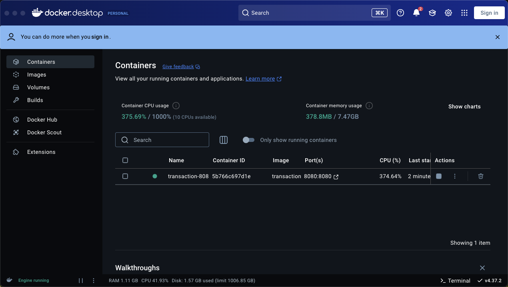
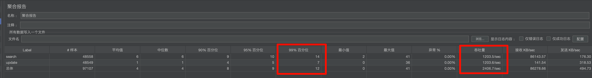

# transaction

## 打包
```mvn package -DskipTests```

## 构建镜像
```sh build_docker.sh```

## 创建并启动容器
```sh run_docker.sh start```

## 停止容器
```sh run_docker.sh stop```

## 单元测试
src/test/java/com/example/transaction/TransactionApplicationTests.java

## 压力测试
1000条数据

docker负载

jmeter聚合报告



1000条数据

docker负载

jmeter聚合报告


## todo
目前增删改复杂度为O(1)
分页查询复杂度为O(n)，考虑到数据存在内存中，可用跳表进行优化，复杂度为O(logn)